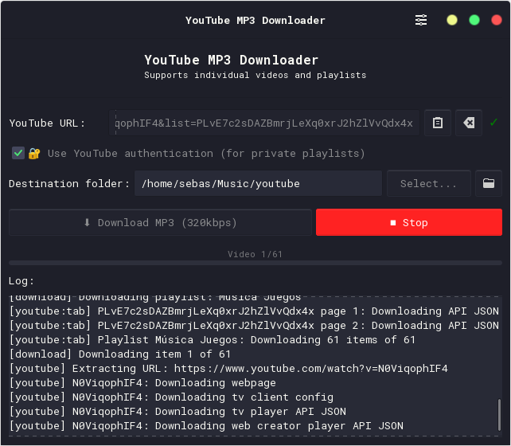

# YouTube MP3 Downloader

A simple and efficient desktop application for downloading YouTube videos and converting them to high-quality MP3 audio files. Paste a link, choose a destination, and get your audio—perfect for listening offline.

The app features a clean, easy-to-use graphical interface built with GTK.

## Screenshots

<p align="center">
  
  <br>
  <em>Initial state of the application.</em>
</p>
<p align="center">
  
  <br>
  <em>Downloading a playlist.</em>
</p>

## Key Features

- **Simple Interface:** Just paste a URL and click download.
- **High-Quality Audio:** Converts videos to 320kbps CBR MP3 files.
- **Video and Playlist Support:** Download single videos or entire playlists.
- **Metadata and Thumbnails:** Automatically embeds the video thumbnail and metadata into the MP3 file.
- **Private Playlist Access:** Log in to YouTube in Firefox to download your private or unlisted playlists.
- **Full Control:** A clear progress bar, live log, and a stop button give you full control over the download process.
- **Smart Error Handling:** The app continues downloading a playlist even if one video fails and provides a detailed error report.

## Installation (Linux)

### Recommended: Install Script

The easiest way to install the application is by using the provided script. This will install the app system-wide, making it available in your application menu.

**1. Install Dependencies:**

First, make sure you have the required tools.

*   **On Arch Linux:**
    ```bash
    sudo pacman -S python python-gobject gtk3 yt-dlp ffmpeg
    ```

*   **On Debian/Ubuntu:**
    ```bash
    sudo apt install python3 python3-gi gir1.2-gtk-3.0 yt-dlp ffmpeg
    ```

**2. Run the Installer:**

Clone this repository, navigate into the project directory, and run:

```bash
sudo ./install.sh
```

The application will now be available as "YouTube MP3 Downloader" in your desktop's application menu. To remove it, you can run `sudo ./uninstall.sh`.

### Manual Execution (for Developers)

If you prefer not to install it system-wide, you can run the application directly from the terminal:

```bash
# Make the script executable (only once)
chmod +x youtube_mp3_downloader.py

# Run the application
./youtube_mp3_downloader.py
```

## How to Use

1.  Open "YouTube MP3 Downloader" from your application menu.
2.  Paste the URL of a YouTube video or playlist.
3.  Select the folder where you want to save the MP3 file(s).
4.  Click **"Download MP3 (320kbps)"**.
5.  Wait for the download to finish.

### Private or Unlisted Playlists

To download content that isn't public, you need to be logged into YouTube.

1.  Make sure you are signed into YouTube in your **Firefox** browser.
2.  In the app, check the box **"🔐 Use YouTube authentication"**.
3.  Paste the private video or playlist URL and start the download.

## Configuration

The application saves your preferences (like the last used folder and window size) in `~/.config/youtube-mp3-downloader/config.json`. You can delete this file to reset the configuration.

---

## For Developers

### Project Structure

```
youtube-mp3-downloader/
├── youtube_mp3_downloader.py      # Main executable script (entry point)
├── youtubemp3downloader/          # Python package for the application
│   ├── __init__.py
│   ├── main.py                    # Application setup and main loop
│   ├── app_window.py              # GTK window and UI logic
│   ├── download.py                # yt-dlp download handling
│   ├── config.py                  # Configuration management
│   └── utils.py                   # Utility functions (e.g., URL validation)
├── data/
│   └── youtube-mp3-downloader.png # Application icon
├── install.sh                     # Installation script
├── uninstall.sh                   # Uninstallation script
├── youtube-mp3-downloader.desktop.template # Desktop entry template
└── README.md
```

### Dependencies

System dependencies are listed in the installation section. The only Python package dependency is `yt-dlp`, which is included in `requirements.txt`.